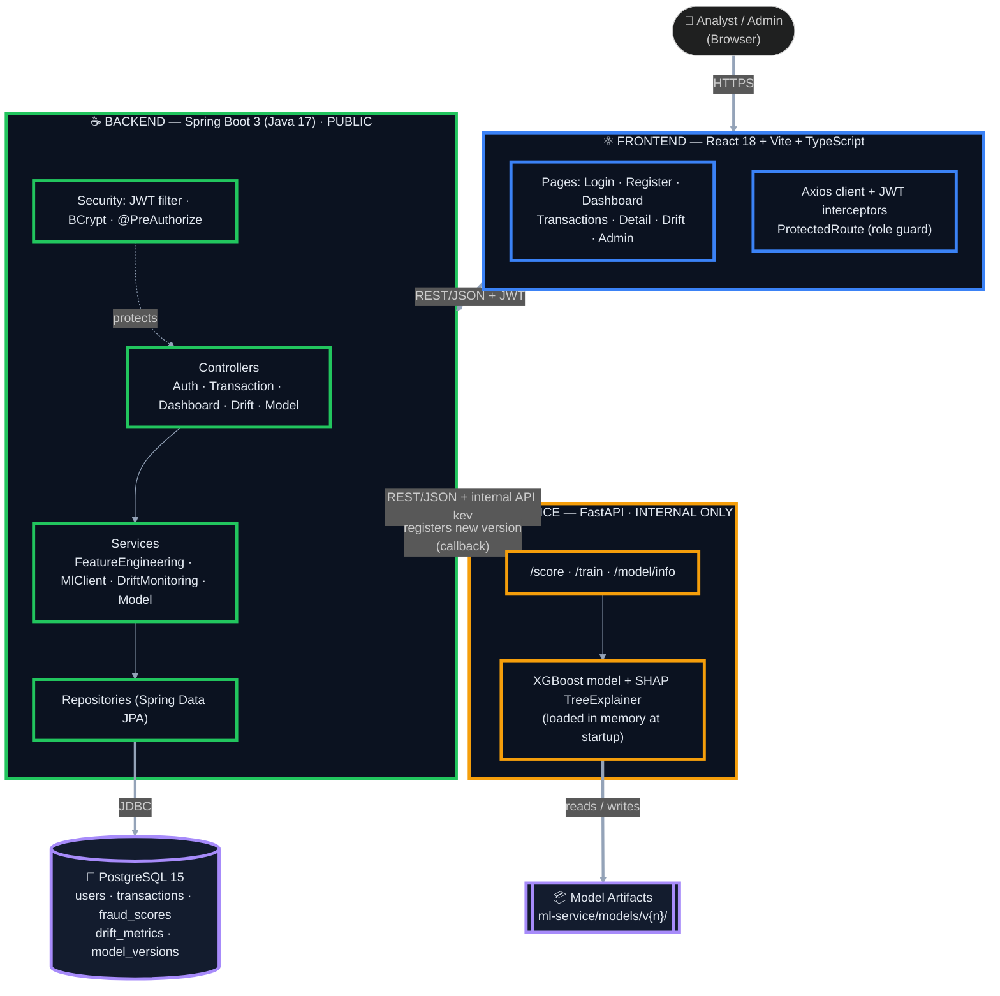
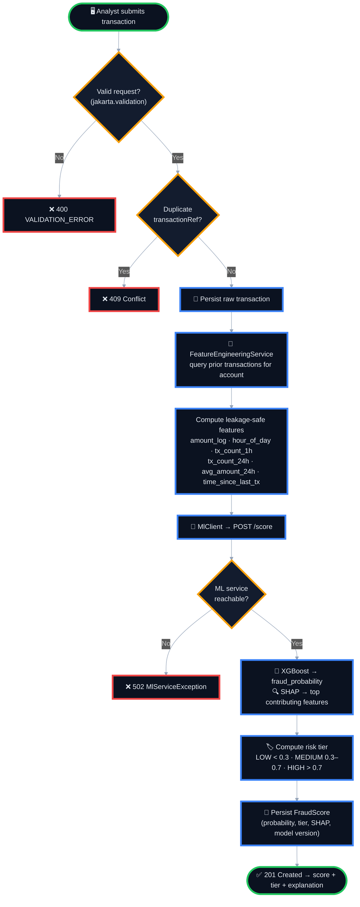
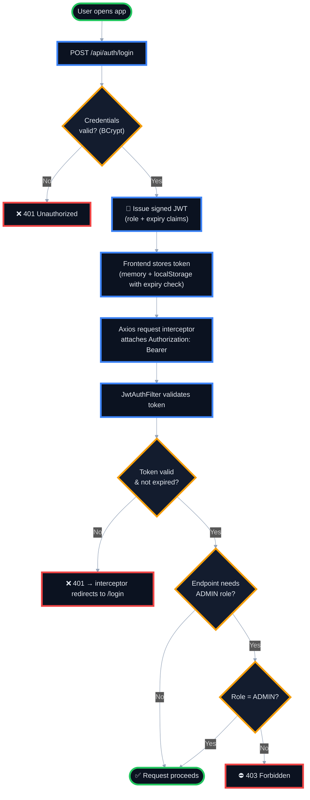
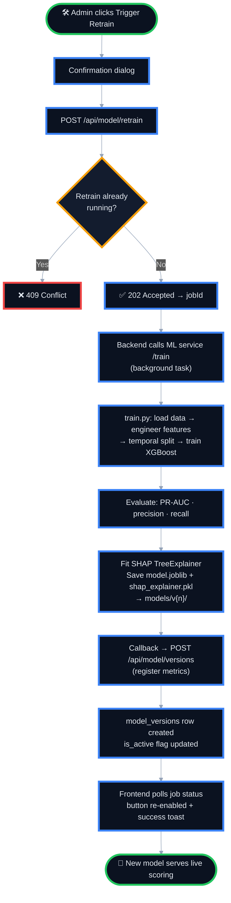
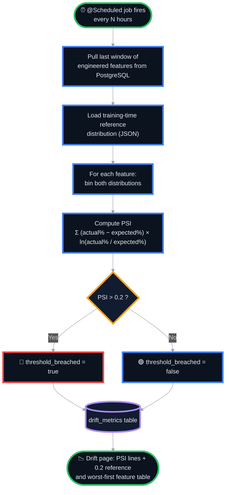
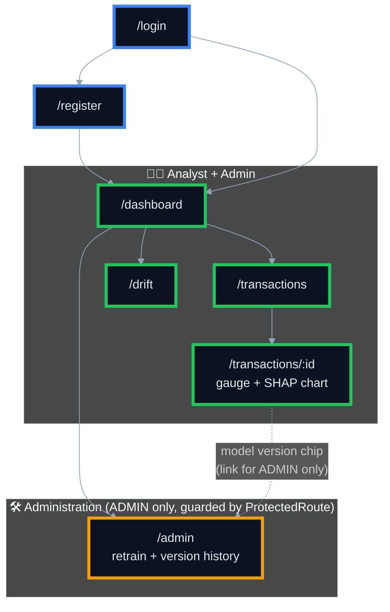
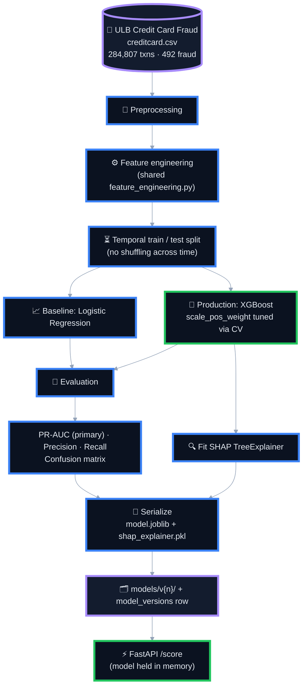
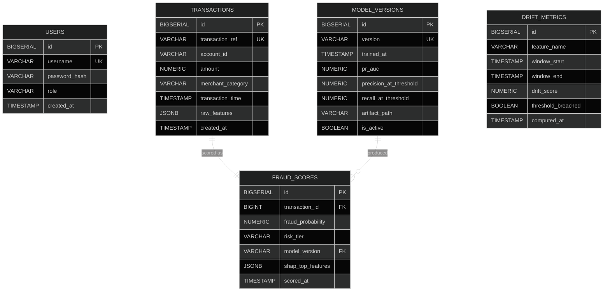
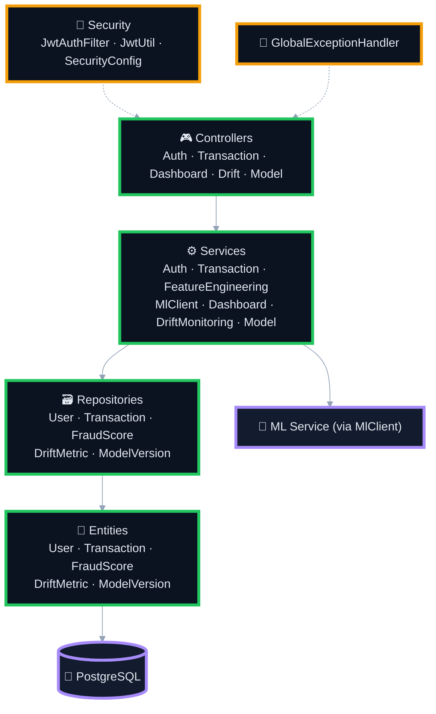
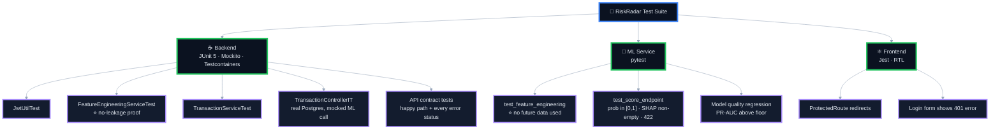

<div align="center">

# 📡 RiskRadar

### AI-Powered Fraud Detection & Monitoring

**Score every transaction in real time. Understand every decision. Catch model drift before it costs you.**

<br/>


<br/>

[✨ Features](#-features) •
[🏗️ Architecture](#️-system-architecture) •
[🔄 Flows](#-flow-diagrams) •
[🚀 Quick Start](#-quick-start) •
[📚 API](#-api-reference) •
[🧪 Testing](#-testing) •
[🗺️ Roadmap](#️-roadmap)

</div>


## 🌐 Overview

**RiskRadar** is a full-stack, real-time transaction fraud detection platform. It ingests financial transactions, scores each one with a trained machine-learning model, **explains why** a transaction was flagged using SHAP, stores the results, and continuously **monitors whether incoming data is drifting** away from what the model was trained on. Everything is surfaced through a polished analyst dashboard.

It is built as three cooperating services plus a database:

| Service | Role |
|---|---|
| ⚛️ **React Frontend** | Analyst & admin dashboard. Talks *only* to the backend. |
| ☕ **Spring Boot Backend** | Single source of truth: auth, persistence, business logic, feature engineering, drift job, ML orchestration. |
| 🐍 **FastAPI ML Service** | Internal-only scoring service that loads an XGBoost model and a SHAP explainer. No database access. |
| 🐘 **PostgreSQL** | Stores users, transactions, scores, drift metrics, and model versions. |

> **In one sentence:** RiskRadar is not just a notebook model — it is the scoring pipeline *and* the operational tooling (explainability, drift tracking, model lifecycle) that a real fraud team needs.

---

## 💡 Why RiskRadar?

Manual fraud review doesn't scale, and naive ML fraud models **silently fail in production** when no one is watching them. RiskRadar addresses this with four principles:

- 🎯 **Imbalance-aware:** fraud is extremely rare (≈0.17% in the training data), so accuracy is meaningless. **PR-AUC** is the primary metric.
- 🔒 **Leakage-safe:** every velocity/rolling feature is computed *strictly* from transactions with an earlier timestamp. This is enforced by automated tests.
- 🔍 **Explainable by default:** every score ships with the top SHAP feature contributions. Explainability is mandatory, not optional.
- 📉 **Drift-aware:** a scheduled job compares live feature distributions against the training-time reference using **Population Stability Index (PSI)** and raises breach alerts.

---

## ✨ Features

### 🧑‍💼 For Analysts

- 🔐 **JWT authentication** with role-based access control
- ⚡ **Real-time scoring** — submit a transaction, get a fraud probability and risk tier instantly
- 📋 **Transaction explorer** — paginated, filterable by risk tier, date range, and search (`transactionRef` / `accountId`)
- 🧠 **Per-transaction explanations** — SHAP top-contributor bar chart (red pushes toward fraud, green toward legitimate)
- 📊 **Dashboard** — total volume, flagged rate, average fraud probability, active model version, score distribution
- 📉 **Drift monitoring** — PSI over time per feature, with a visible 0.2 breach threshold line

### 🛠️ For Admins

Everything an analyst can do, plus:

- 🔁 **One-click model retraining** with a confirmation dialog and live job-status polling
- 🗂️ **Model version history** — PR-AUC, precision, recall per version, active version highlighted, PR-AUC trend sparkline

### 🎨 Product Polish

- 🌗 Light / dark mode with a persistent toggle
- 📱 Responsive down to 375px (sidebar collapses to a hamburger top bar)
- ♿ Accessible: keyboard navigation, chart `aria-label`s, WCAG-AA contrast, risk tier always shown as text plus color
- 💀 Skeleton loaders, retry-capable error states, and actionable empty states on every page

---

## 🏗️ System Architecture

The React app never talks to the ML service directly. Spring Boot is the only public entry point and the only caller of the internal ML microservice.



### Architectural Principles

| Principle | How it's enforced |
|---|---|
| **Single source of truth** | Only Spring Boot reads/writes PostgreSQL. |
| **ML is pure computation** | The Python service is stateless per request and never touches the database. |
| **Network isolation** | Port `8000` is never exposed publicly; a shared internal API key header adds defense in depth. |
| **One translation point** | The `MlClient` DTO layer converts Python `snake_case` to Java/JSON `camelCase`; the frontend never sees `snake_case`. |
| **Feature parity** | `feature_engineering.py` is shared by training and live scoring to prevent train/serve skew. |

---

## 🔄 Flow Diagrams

### 1. Real-Time Scoring Flow

What happens when a transaction is submitted (`POST /api/transactions`):



### 2. Scoring Sequence

```mermaid
%%{init: {'theme':'dark'}}%%
sequenceDiagram
    autonumber
    actor Analyst
    participant FE as React Frontend
    participant BE as Spring Boot
    participant DB as PostgreSQL
    participant ML as FastAPI ML Service

    Analyst->>FE: Fill in & submit transaction
    FE->>BE: POST /api/transactions (Bearer JWT)
    BE->>BE: Validate JWT, role & request body
    BE->>DB: INSERT transaction
    BE->>DB: SELECT prior txns for account_id (time &lt; T)
    DB-->>BE: Recent history
    BE->>BE: Build velocity / rolling features
    BE->>ML: POST /score (feature vector + internal key)
    ML->>ML: XGBoost predict_proba + SHAP values
    ML-->>BE: fraud_probability, shap_top_features
    BE->>BE: Map to risk tier, translate to camelCase
    BE->>DB: INSERT fraud_score
    BE-->>FE: 201 { fraudProbability, riskTier, shapTopFeatures, modelVersion }
    FE-->>Analyst: Gauge + SHAP chart + risk badge
```

### 3. Authentication & Authorization Flow



### 4. Model Retraining Lifecycle (Admin)



### 5. Drift Monitoring Flow



### 6. Frontend Navigation Map



---

## 🛠️ Tech Stack

| Layer | Technology |
|---|---|
| **Backend** | Java 17 · Spring Boot 3.x · Spring Web · Spring Security · Spring Data JPA · Lombok |
| **Auth** | JWT (`jjwt`) · BCrypt password hashing · role-based `@PreAuthorize` |
| **Database** | PostgreSQL 15 · JSONB columns for SHAP output and raw features |
| **ML Service** | Python 3.11 · FastAPI · scikit-learn · XGBoost · SHAP · pandas · joblib |
| **Frontend** | React 18 · Vite · TypeScript · React Router · Axios |
| **UI / Styling** | Tailwind CSS · shadcn/ui · lucide-react · Recharts |
| **Typography** | Inter (UI) · JetBrains Mono (IDs, refs, versions) |
| **Build tools** | Maven · pip / venv · npm |
| **Containers** | Docker · Docker Compose |
| **Testing** | JUnit 5 · Mockito · Testcontainers · pytest · Jest / RTL |

---

## 🧠 Machine Learning Pipeline



### Dataset

The **ULB Credit Card Fraud** dataset: 284,807 transactions, of which only **492 are fraud**. It contains `Time`, `Amount`, and anonymized PCA components `V1`–`V28`.

### Engineered Features

| Feature | Meaning |
|---|---|
| `amount_log` | Log-scaled transaction amount |
| `hour_of_day` | Hour extracted from transaction time |
| `tx_count_last_1h_per_account` | Account's transaction count in the previous hour |
| `tx_count_last_24h_per_account` | Account's transaction count in the previous 24 hours |
| `avg_amount_last_24h_per_account` | Account's average amount over the previous 24 hours |
| `time_since_last_tx_per_account` | Seconds since the account's previous transaction |
| `V1` – `V28` | Raw PCA components |

### 🔒 Leakage Prevention

All rolling and velocity features use **only transactions with `transaction_time` strictly earlier than the current one**. The train/test split is **temporal**, never random. This is verified by dedicated tests on both sides of the stack (`FeatureEngineeringServiceTest` in Java and `test_feature_engineering.py` in Python) — the most important tests in the project.

### 🎯 Why PR-AUC and Not Accuracy?

With ≈0.17% fraud, a model that always predicts "legitimate" is ≈99.8% accurate and completely useless. **Precision-Recall AUC** measures how well the model ranks the rare positive class, so it is the primary metric, alongside precision and recall at the chosen operating threshold.

### 🏷️ Risk Tiers

| Tier | Probability range | Badge |
|---|---|---|
| **LOW** | `< 0.3` | 🟢 |
| **MEDIUM** | `0.3 – 0.7` | 🟠 |
| **HIGH** | `> 0.7` | 🔴 |

### 🔍 Explainability

Each score includes the top contributing features:

```json
{
  "shapTopFeatures": [
    { "feature": "txCountLast1h", "value": 6,    "contribution": 0.31 },
    { "feature": "amountLog",     "value": 8.43, "contribution": 0.18 }
  ]
}
```

Positive contributions push the score **toward fraud**; negative contributions push it **toward legitimate**.

### ML Service Endpoints (internal)

| Endpoint | Purpose |
|---|---|
| `POST /score` | Score one feature vector → probability + SHAP values |
| `POST /train` | Kick off `training/train.py` in the background, return a job id |
| `GET /model/info` | Metadata of the currently active model |

---

## 📉 Drift Monitoring

Models degrade silently when live data stops resembling training data. RiskRadar tracks this with the **Population Stability Index (PSI)**.

```
PSI = Σ ( actual% − expected% ) × ln( actual% / expected% )
```

| PSI value | Interpretation |
|---|---|
| `< 0.1` | 🟢 Stable |
| `0.1 – 0.2` | 🟡 Moderate shift, watch closely |
| `> 0.2` | 🔴 **Breach** — significant drift, `threshold_breached = true` |

**Methodology**

1. A reference distribution per feature is saved as JSON at training time.
2. A `@Scheduled` job in Spring Boot runs every N hours, pulling the latest window of engineered features from PostgreSQL.
3. PSI is computed per feature against the reference and written to `drift_metrics`.
4. The Drift page charts PSI over time with a horizontal threshold line at 0.2 and lists all features worst-first.

Drift is computed as a **batch job**, deliberately *not* per request, so it adds zero latency to the scoring path — matching how production systems do it.

---

## 🗄️ Database Design



**Indexes**

- `transactions(account_id, transaction_time)` — composite, powers velocity-feature lookups
- `fraud_scores(risk_tier)` — dashboard filtering
- `drift_metrics(feature_name, window_start)` — drift history queries

**Rules:** `users.role ∈ {ANALYST, ADMIN}` · `fraud_scores.transaction_id` is unique (one score per transaction) · only one `model_versions` row has `is_active = true` at a time. `drift_metrics` is independent — computed per feature per time window.

---

## 🧩 Backend Structure



- **Validation:** `jakarta.validation` on every request DTO (`@NotNull`, `@Positive`, …)
- **Errors:** one `@ControllerAdvice` returns a consistent JSON error shape
- **ML failures:** `MlClient` wraps timeouts/5xx in `MlServiceException`, surfaced as `502`
- **Logging:** SLF4J at INFO for every request, ERROR for failures (including ML-unreachable)

---

## 📚 API Reference

All endpoints use **camelCase JSON**. Protected endpoints require `Authorization: Bearer <token>`.

| Method | Endpoint | Auth | Description |
|---|---|---|---|
| `POST` | `/api/auth/register` | — | Create a user account |
| `POST` | `/api/auth/login` | — | Authenticate and receive a JWT |
| `POST` | `/api/transactions` | Analyst / Admin | Submit a transaction and get a real-time score |
| `GET` | `/api/transactions` | Analyst / Admin | Paginated, filterable transaction list |
| `GET` | `/api/transactions/{id}` | Analyst / Admin | Full transaction detail |
| `GET` | `/api/transactions/{id}/explanation` | Analyst / Admin | SHAP explanation only |
| `GET` | `/api/dashboard/summary` | Analyst / Admin | Aggregate dashboard statistics |
| `GET` | `/api/drift/metrics` | Analyst / Admin | Drift history (optionally by `feature`) |
| `POST` | `/api/model/retrain` | **Admin** | Trigger model retraining |
| `GET` | `/api/model/versions` | Analyst / Admin | All model versions with metrics |

<details>
<summary><b>🔐 POST /api/auth/register</b></summary>

**Request**
```json
{ "username": "analyst1", "password": "StrongPass123!", "role": "ANALYST" }
```
**Response `201`**
```json
{ "id": 1, "username": "analyst1", "role": "ANALYST" }
```
**Errors:** `400` validation · `409` username taken
</details>

<details>
<summary><b>🔑 POST /api/auth/login</b></summary>

**Request**
```json
{ "username": "analyst1", "password": "StrongPass123!" }
```
**Response `200`**
```json
{ "token": "eyJhbGciOi...", "role": "ANALYST", "expiresIn": 3600 }
```
**Errors:** `401` bad credentials
</details>

<details>
<summary><b>⚡ POST /api/transactions</b></summary>

**Request**
```json
{
  "transactionRef": "TXN-2026-000123",
  "accountId": "ACC-88213",
  "amount": 4599.00,
  "merchantCategory": "electronics",
  "transactionTime": "2026-09-17T14:32:00Z",
  "rawFeatures": { "v1": -1.23, "v2": 0.44 }
}
```
**Response `201`**
```json
{
  "transactionId": 501,
  "fraudProbability": 0.87,
  "riskTier": "HIGH",
  "shapTopFeatures": [
    { "feature": "txCountLast1h", "value": 6, "contribution": 0.31 },
    { "feature": "amountLog", "value": 8.43, "contribution": 0.18 }
  ],
  "modelVersion": "v3"
}
```
**Errors:** `400` validation · `409` duplicate `transactionRef` · `502` ML service unreachable
</details>

<details>
<summary><b>📋 GET /api/transactions?riskTier=HIGH&page=0&size=20</b></summary>

**Response `200`**
```json
{
  "content": [
    {
      "transactionId": 501,
      "accountId": "ACC-88213",
      "amount": 4599.00,
      "riskTier": "HIGH",
      "fraudProbability": 0.87,
      "transactionTime": "2026-09-17T14:32:00Z"
    }
  ],
  "totalElements": 1,
  "totalPages": 1
}
```
</details>

<details>
<summary><b>📊 GET /api/dashboard/summary</b></summary>

**Response `200`**
```json
{
  "totalTransactions": 12000,
  "flaggedRate": 0.021,
  "scoreDistribution": [
    { "bucket": "0.0-0.2", "count": 9000 },
    { "bucket": "0.8-1.0", "count": 250 }
  ],
  "activeModelVersion": "v3"
}
```
</details>

<details>
<summary><b>📉 GET /api/drift/metrics?feature=amountLog</b></summary>

**Response `200`**
```json
[
  {
    "featureName": "amountLog",
    "windowStart": "2026-09-10T00:00:00Z",
    "windowEnd": "2026-09-17T00:00:00Z",
    "driftScore": 0.24,
    "thresholdBreached": true
  }
]
```
</details>

<details>
<summary><b>🔁 POST /api/model/retrain &nbsp;·&nbsp; 🗂️ GET /api/model/versions</b></summary>

**Retrain — Response `202`**
```json
{ "jobId": "retrain-2026-09-17-01", "status": "STARTED" }
```
**Errors:** `403` non-admin · `409` retrain already in progress

**Versions — Response `200`**
```json
[
  {
    "version": "v3",
    "trainedAt": "2026-09-15T10:00:00Z",
    "prAuc": 0.91,
    "precision": 0.88,
    "recall": 0.79,
    "isActive": true
  }
]
```
</details>

<details>
<summary><b>🚨 Global error shape</b></summary>

```json
{
  "timestamp": "2026-09-17T14:32:00Z",
  "status": 400,
  "error": "VALIDATION_ERROR",
  "message": "amount must be positive",
  "path": "/api/transactions"
}
```
</details>

---

## 🎨 Frontend & Design System

RiskRadar's UI follows a **clean fintech/risk-tooling aesthetic**: a calm neutral base, one confident accent color, and color used *functionally* (risk tiers) rather than decoratively.

### Color Tokens

| Token | Light | Dark | Used for |
|---|---|---|---|
| `--background` | `#F8FAFC` | `#0B1220` | Page background |
| `--surface` | `#FFFFFF` | `#131C2E` | Cards, tables |
| `--primary` | `#2563EB` | `#3B82F6` | Actions, links, active nav |
| `--text` | `#0F172A` | `#E2E8F0` | Body text |
| `--muted` | `#64748B` | `#94A3B8` | Secondary text |
| `--border` | `#E2E8F0` | `#1E293B` | Dividers |
| `--risk-low` | `#16A34A` | `#22C55E` | LOW badge |
| `--risk-medium` | `#D97706` | `#F59E0B` | MEDIUM badge |
| `--risk-high` | `#DC2626` | `#EF4444` | HIGH badge |

**Type:** Inter for UI · JetBrains Mono for IDs, refs and model versions · **Spacing:** 8px base unit, 1280px max width, 12px radius · **Motion:** subtle 150ms fades only.

### Pages

| Page | Route | Access | Highlights |
|---|---|---|---|
| **Login** | `/login` | Public | Show/hide password, inline 401 banner |
| **Register** | `/register` | Public | Live validation checkmarks, role segmented control |
| **Dashboard** | `/dashboard` | Analyst + Admin | 4 stat cards, score-distribution chart, recent high-risk panel |
| **Transactions** | `/transactions` | Analyst + Admin | Risk chips, date range, search, inline probability bars, pagination |
| **Transaction Detail** | `/transactions/:id` | Analyst + Admin | Fraud gauge, SHAP bar chart, collapsible raw features |
| **Drift Monitoring** | `/drift` | Analyst + Admin | Feature selector, PSI line chart with 0.2 threshold, worst-first table |
| **Administration** | `/admin` | **Admin only** | Retrain with confirm dialog, job polling, version history + sparkline |

### Shared Components

`RiskBadge` · `StatCard` · `DataTable` · `ShapBarChart` · `FraudGauge` · `EmptyState` · `ErrorState` · `LoadingSkeleton` · `ConfirmDialog` · `Toast` · `ProtectedRoute` · `RoleBadge` · `NavBar / Sidebar`

### Four States on Every Page

| State | Behavior |
|---|---|
| ⏳ **Loading** | Skeletons that keep the layout visible, never a blank screen |
| ❌ **Error** | Clear message with a **Retry** action |
| 📭 **Empty** | Helpful, actionable copy (e.g. "Clear filters") |
| ✅ **Success** | Full data view |

### Accessibility

- Fully keyboard-navigable
- Charts carry `aria-label` summaries
- Risk tiers are always shown as **text + color**, never color alone
- 4.5:1 minimum contrast in both themes
- Responsive: mobile `< 768px`, tablet `768–1024px`, desktop `> 1024px`

> **Admin isolation:** the Admin link is absent from the DOM for ANALYST users (not just CSS-hidden), enforced by `ProtectedRoute` on the client and `@PreAuthorize("hasRole('ADMIN')")` on the server.

---

## 📁 Project Structure

```
riskradar/
├── backend/
│   ├── src/main/java/com/frauddetect/
│   │   ├── config/            # SecurityConfig, JwtConfig, WebClientConfig
│   │   ├── controller/        # Auth, Transaction, Dashboard, Drift, Model
│   │   ├── service/           # Business logic, FeatureEngineering, MlClient, DriftMonitoring
│   │   ├── repository/        # Spring Data JPA repositories
│   │   ├── entity/            # User, Transaction, FraudScore, DriftMetric, ModelVersion
│   │   ├── dto/               # request/ and response/ DTOs
│   │   ├── security/          # JwtAuthFilter, JwtUtil
│   │   ├── exception/         # GlobalExceptionHandler + custom exceptions
│   │   └── FraudDetectionApplication.java
│   ├── src/main/resources/    # application.yml, application-docker.yml
│   ├── src/test/java/         # Unit + integration tests
│   ├── pom.xml
│   └── Dockerfile
│
├── ml-service/
│   ├── app/
│   │   ├── main.py                  # FastAPI: /score, /train, /model/info
│   │   ├── feature_engineering.py   # Shared by training + live scoring
│   │   ├── model_loader.py
│   │   └── schemas.py               # Pydantic models
│   ├── training/
│   │   ├── train.py
│   │   └── evaluate.py
│   ├── models/                # Versioned artifacts (v1/, v2/, …)
│   ├── notebooks/eda.ipynb
│   ├── tests/
│   ├── requirements.txt
│   └── Dockerfile
│
├── frontend/
│   ├── src/
│   │   ├── pages/             # Login, Register, Dashboard, Transactions, Detail, Drift, Admin
│   │   ├── components/        # RiskBadge, ShapBarChart, FraudGauge, ProtectedRoute, …
│   │   ├── api/               # Axios client + API modules
│   │   ├── context/           # AuthContext
│   │   └── App.tsx
│   ├── package.json
│   └── Dockerfile
│
├── database/init.sql          # Schema DDL for local bootstrap
├── docs/README.md
├── docker-compose.yml
└── .env.example
```

---

## 🚀 Quick Start

### Prerequisites

| Tool | Version |
|---|---|
| Docker + Docker Compose | Latest |
| *(Manual run only)* Java | 17 |
| *(Manual run only)* Maven | 3.9+ |
| *(Manual run only)* Python | 3.11 |
| *(Manual run only)* Node.js | 18+ |

### 🐳 Option 1 — Docker Compose (recommended)

```bash
# 1. Clone the repository
git clone https://github.com/<your-username>/riskradar.git
cd riskradar

# 2. Configure environment
cp .env.example .env
# open .env and fill in real values (see Environment Variables below)

# 3. Build and start everything
docker compose up --build
```

| Service | URL |
|---|---|
| 🖥️ Frontend | http://localhost:5173 |
| ☕ Backend API | http://localhost:8080 |
| 🐍 ML Service | http://localhost:8000 *(internal, not for direct browser use)* |

### 🔧 Option 2 — Manual Run (per service)

**1️⃣ ML service**

```bash
cd ml-service
python -m venv venv
source venv/bin/activate          # Windows: venv\Scripts\activate
pip install -r requirements.txt
python training/train.py          # produces the initial model artifact
uvicorn app.main:app --port 8000
```

**2️⃣ Backend**

```bash
cd backend
mvn clean install
mvn spring-boot:run
```

**3️⃣ Frontend**

```bash
cd frontend
npm install
npm run dev
```

> 📌 **Training data:** download the ULB `creditcard.csv` dataset and place it where `training/train.py` expects it before the first training run.

### 👤 First Run

1. Open the frontend and **register** a user (Analyst or Admin).
2. Sign in — you land on the Dashboard.
3. Submit transactions through the API (or a seed/simulation script) to populate scores.
4. As an **Admin**, open **Administration** to review model versions or trigger a retrain.

---

## 🔐 Environment Variables

All secrets live in a gitignored `.env` file. `.env.example` documents every variable with a placeholder — **never commit real values**.

### Backend

| Variable | Description |
|---|---|
| `DB_URL` | JDBC URL of PostgreSQL |
| `DB_USERNAME` | Database user |
| `DB_PASSWORD` | Database password |
| `JWT_SECRET` | Secret used to sign JWTs |
| `JWT_EXPIRATION_MS` | Token lifetime in milliseconds |
| `ML_SERVICE_BASE_URL` | e.g. `http://ml-service:8000` |
| `ML_SERVICE_INTERNAL_KEY` | Shared secret sent to the ML service |
| `SERVER_PORT` | Default `8080` |
| `CORS_ALLOWED_ORIGINS` | e.g. `http://localhost:5173` |

### ML Service

| Variable | Description |
|---|---|
| `MODEL_DIR` | Model artifact directory (default `./models`) |
| `ACTIVE_MODEL_VERSION` | Version to load at startup |
| `PORT` | Default `8000` |
| `INTERNAL_API_KEY` | Must match the backend's `ML_SERVICE_INTERNAL_KEY` |

### Frontend

| Variable | Description |
|---|---|
| `VITE_API_BASE_URL` | e.g. `http://localhost:8080/api` |

### Database (Docker Compose)

`POSTGRES_DB` · `POSTGRES_USER` · `POSTGRES_PASSWORD`

---

## 🧪 Testing



### Running the tests

```bash
# Backend
cd backend && mvn test

# ML service
cd ml-service && pytest

# Frontend
cd frontend && npm test
```

### Edge Cases Covered

- Duplicate `transactionRef`
- Negative `amount`
- Missing `accountId`
- ML service timeout / 500
- Expired JWT
- Non-admin calling `/api/model/retrain`

### ⭐ The Two Tests That Matter Most

1. **Leakage test** — a feature computed for a transaction at time `T` must never use a transaction with time `> T`.
2. **PR-AUC regression test** — the held-out PR-AUC must stay above a fixed floor (e.g. `0.85`), so a bad retrain fails CI.

---

## 🛡️ Security

| Area | Measure |
|---|---|
| **Passwords** | BCrypt hashing, never stored in plain text |
| **Sessions** | Stateless JWT with expiry; expired tokens rejected |
| **Authorization** | Role-based `@PreAuthorize` on admin endpoints, mirrored by client route guards |
| **Service isolation** | ML service is internal-only; requires a shared internal API key |
| **Secrets** | Environment variables only; `.env` gitignored |
| **Input validation** | `jakarta.validation` (backend), Pydantic (ML), form validation (frontend) |
| **CORS** | Restricted to configured origins |

**Production hardening notes:** run behind an Nginx reverse proxy terminating TLS · set `CORS_ALLOWED_ORIGINS` to the real frontend domain · never expose port `8000` · use managed PostgreSQL · rotate `JWT_SECRET` per environment.

---

## 🧭 Design Decisions & Known Limitations

| Topic | Decision |
|---|---|
| **Ground truth on live traffic** | The ULB dataset is used for training and offline evaluation only. Live transactions are scored but unlabeled. |
| **Drift computation** | Scheduled batch job rather than per request, to avoid latency on the scoring path. |
| **Synchronous ML call** | Scoring is a blocking call from the backend — acceptable for MVP scope; a queue-based async design is a next step. |
| **Retraining** | Manual and Admin-triggered; automatic scheduling is a future enhancement. |
| **Model versioning** | Simple `models/v{n}/` folders plus an `is_active` flag — one active version at a time, no blue/green. |
| **Open registration** | The role selector on Register is an intentional **demo simplification**; a real product would make Admin accounts invite-only. |
| **No upstream payment system** | Transactions are submitted directly through the API to simulate one. |

---

## 🗺️ Roadmap

- [ ] ✅ Analyst feedback loop — `is_confirmed_fraud` flag settable via a small `PATCH` endpoint
- [ ] 🌱 Transaction simulation / seeding script for demos
- [ ] ⚡ Async scoring through a message queue
- [ ] 🔄 Scheduled automatic retraining
- [ ] 🔔 Alerting (email / Slack) on drift breaches and HIGH-risk spikes
- [ ] 🔀 Blue/green model rollout with shadow scoring
- [ ] 🔑 Invite-only admin onboarding
- [ ] 📈 Week-over-week trend indicators on dashboard cards

---

## 👩‍💻 Author

**Dhruvi**
Third-year B.Tech CSE (AI) · Full-stack MERN developer

[](https://github.com/<your-username>)
[](https://linkedin.com/in/<your-handle>)

---

<div align="center">

### 📡 RiskRadar

*Score fast. Explain clearly. Watch the drift.*

⭐ If you found this project useful, consider giving it a star!

</div>
